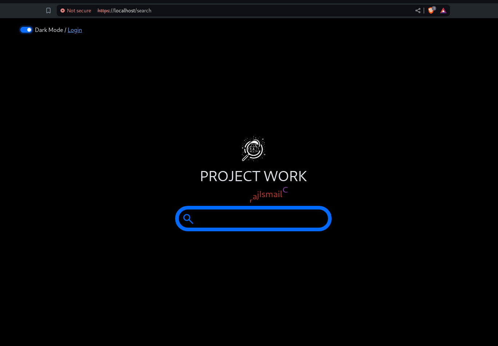
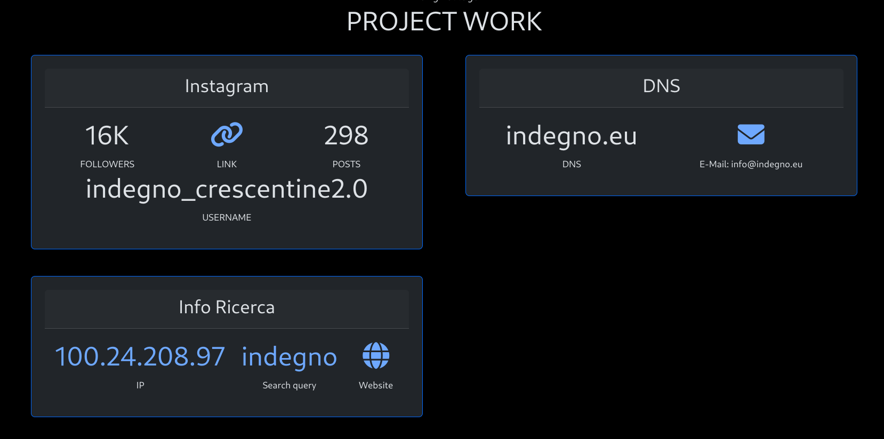
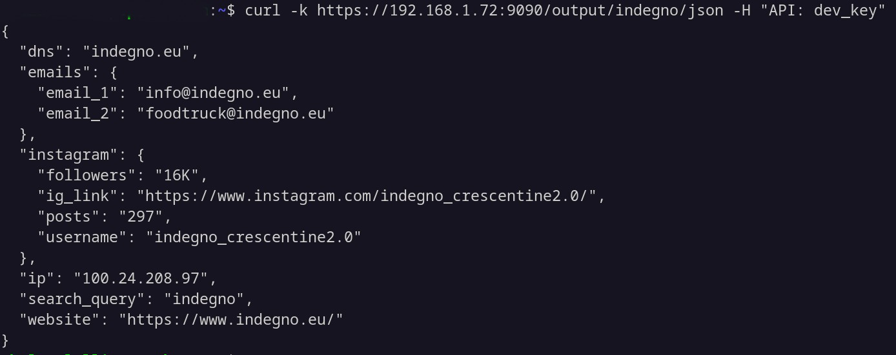
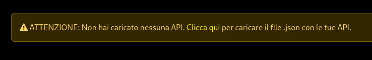
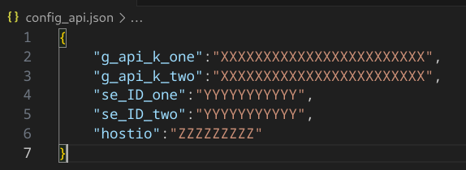

**Disclaimer** : Software a solo fine didattico. Non siamo responsabili per qualsiasi uso improprio!

# Project Work 2 (Monitoraggio presenza aziende Online)
### Progetto in fase di completamento
Potrebbe essere quasi tutto pronto.
Ora è possibile utilizzare docker-compose per avviare la webapp.


### In estrema sintesi...
WebApp che permette di inserire il nome di un'azienda locale e restituisce come risultato una raccolta di lcune informazioni pubbliche sul soggetto cercato.
Utile in una prima fase di OSINT.
Utilizzo di API per raccogliere dati da altri servizi online.
Python, Mysql e Docker "dietro le quinte".

## Struttura del progetto

Abbiamo pensato di organizzare il progetto in containers attraverso Docker Compose. Il progetto è chiaramente riassunto nel file `docker-compose.yaml`: 

1. Un container che esegue lo script Python (Flask) che funge da server web di backend e distribuisce l'interfaccia web.

2. Un container che agisce come API interna sempre realizzata in python attraverso l'utilizzo di Flask. Questo script si occupa sia di fare le ricerche online (sfruttando API esterne: google etc..), sia di fornire i risultati al server di backend in formato JSON, sia di salvare i risultati delle ricerche in un database.

3. Uno o più container MySql Database(s) in cui verranno salvate sia le informazioni utili al backend sia i risultati delle ricerche esterne.

4. Un container MySql Database in cui vengono salvate le API che l'utente passa alla webapp.

#### TEST FRONTEND:
<p align="center">

</p>

#### TEST RISULTATO DI RICERCA (l'indirizzo IP e search query sono cliccabili per approfondire):

<p align="center">

</p>

#### TEST RISULTATO DI RICERCA IN JSON (CURL da terminale, ancora in fase di testing):

<p align="center">

</p>

## Avviare la webapp

Per poter utilizzare la webapp in locale è sufficiente seguire i seguenti passaggi:

#### Come prima cosa creaiamo gli utenti di entrambi i database e i rispettivi secrets (sono inoltre integrati in docker-compose ed utilizzati dalla search_app):

```
cd ProjectWork
python setup_secrets.py
```

#### Poi avviamo il progetto docker-compose.yaml:
```
docker-compose up -d
```

Nel browser visitiamo il seguente indirizzo : `https://localhost/`.
<br><hr>
Come prima cosa apparirà un messaggio di ATTENZIONE:

<p align="center">

</p>

Questo perché è necessario fornire alla webapp un file di configurafione in formato JSON così strutturato:

<p align="center">

</p>

Sono quindi necessarie 2 API keys di Google con relativi SE_ID, e un'API key di HOSTIO

# TO DO
In questa settimana termineremo il progetto.
La nostra to do list contiene i seguenti punti:

- Ampliare il numero di risultati di ricerca, salvarli in uno storico, poi metterli a confronto, grafici.
- Definire meglio le privacy policy e la conformità con il GDPR
- Presentazione e report.
